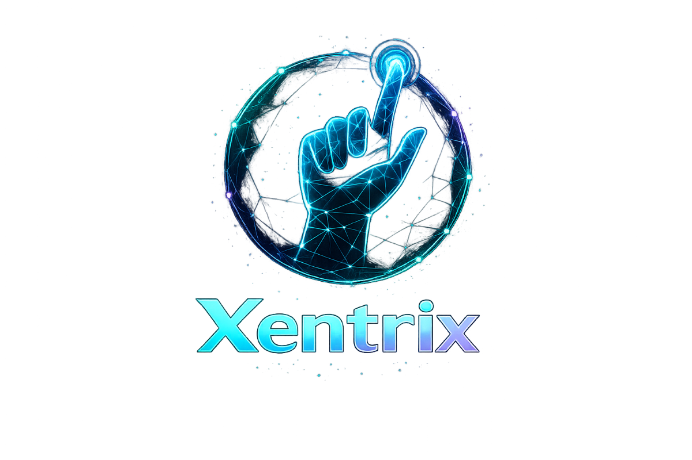

# ✨ Xentrix Coming Soon

<div align="center">



### Real-Time AI Hand Gesture Recognition — Powered Entirely by Your Browser

A modern browser-based AI platform that transforms natural hand gestures into real-time digital interactions using MediaPipe and Computer Vision.

[]()
[]()
[]()
[]()
[]()

🌐 **Live Website:** 

⭐ Star this repository if you like the project!

</div>

---

# 📖 About

Xentrix is an AI-powered web application that performs real-time hand tracking and gesture recognition entirely inside the browser.

Unlike traditional computer vision applications, Xentrix requires **no software installation**, **no backend server**, and **no cloud processing**. Every gesture is processed locally using modern browser technologies, ensuring high performance, low latency, and complete user privacy.

The platform combines computer vision, responsive web technologies, and modern UI design to provide an intuitive and interactive gesture-based experience.

---

# 🚀 Development Timeline

## 🚀 Development Timeline

| Phase | Duration |
|------------------------------|-------------------------|
| Project Planning & Research | April 2025 |
| UI/UX Design | May – July 2025 |
| AI Integration & Prototype Development | August – October 2025 |
| Project Enhancement & Development Pause | November 2025 – January 2026 |
| Core Feature Development | February – April 2026 |
| Testing, Optimization & Bug Fixes | May – June 2026 |
| Public Release | August 2026 |

**Development Period:** **April 2025 – July 2026**

---

# ✨ Features

- 🤖 Real-Time AI Hand Tracking
- ✋ Gesture Recognition
- 🎨 Air Drawing
- 🖱 Virtual Mouse Control
- 🔢 Finger Counter
- 📷 Live Webcam Processing
- 📊 Real-Time Analytics
- ⚡ Browser-Based AI Processing
- 🔒 Privacy-Focused Architecture
- 📱 Fully Responsive UI
- 🌙 Modern Dark Interface
- 🚀 Progressive Web App (PWA)

---

# 🖥 Modules

### 🏠 Home

Modern landing page introducing Xentrix and its capabilities.

---

### 🤖 AI Playground

Interactive environment for testing all AI features.

---

### ✋ Gesture Recognition

Recognizes hand gestures in real time.

---

### 🎨 Air Drawing

Draw naturally using your index finger.

---

### 🖱 Virtual Mouse

Control the mouse cursor using hand movement.

---

### 🔢 Finger Counter

Counts raised fingers instantly.

---

### 📊 Live Analytics

Displays

- Detection Time
- FPS
- Handedness
- Coordinates
- Gesture Name

---

### 📚 Documentation

Complete documentation and project information.

---

# 📸 Screenshots

| Home |
|------|
|  |

| AI Playground |
|------|
|  |

| Gesture Recognition |
|------|
|  |

| Air Drawing |
|------|
|  |

| Virtual Mouse |
|------|
|  |

| Finger Counter |
|------|
|  |

---

# 🛠 Tech Stack

## Frontend

- React
- TypeScript
- Vite
- Tailwind CSS
- Framer Motion

## AI

- MediaPipe Tasks Vision

## UI

- Lucide React
- React Helmet
- React Hot Toast
- Chart.js

## Deployment

- Firebase Hosting

---

# 📦 Progressive Web App (PWA)

Xentrix is available as a **Progressive Web App**, allowing users to install it directly from their browser for a more app-like experience.

## Install on Desktop

1. Open the Live Website.
2. Click the **Install App** icon in the browser address bar.
3. Select **Install**.
4. Launch Xentrix directly from your desktop.

## Install on Android

1. Open the website in Chrome.
2. Tap the **⋮** menu.
3. Choose **Install App** or **Add to Home Screen**.
4. Confirm the installation.

## Install on iPhone

1. Open the website in Safari.
2. Tap **Share**.
3. Select **Add to Home Screen**.
4. Tap **Add**.

---

# 📥 Download

### 🌐 Live Web Application

https://xentrix-vision.web.app

### 📲 Install as an App

Simply open the website in a supported browser and choose **Install App**.

No APK or desktop installer is required.

---

# 🔒 Privacy

Xentrix processes every camera frame locally inside the browser.

✔ No backend

✔ No cloud processing

✔ No video uploads

✔ No user tracking

✔ Camera data never leaves your device

---

# ⚙ Installation

Clone the repository

```bash
git clone https://github.com/YOUR_USERNAME/Xentrix.git
```

Install dependencies

```bash
npm install
```

Run development server

```bash
npm run dev
```

Build

```bash
npm run build
```

Preview

```bash
npm run preview
```

Deploy

```bash
firebase deploy
```

---

# 📂 Project Structure

```
src
│
├── components
├── hooks
├── pages
├── utils
├── styles
├── assets
│
├── App.tsx
├── main.tsx
│
public
package.json
vite.config.ts
```

---

# 🛣 Roadmap

- ✅ Gesture Recognition
- ✅ Air Drawing
- ✅ Virtual Mouse
- ✅ Finger Counter
- ✅ PWA Support
- 🔄 Custom Gesture Training
- 🔄 Multi-Hand Tracking
- 🔄 Gesture Shortcuts
- 🔄 Sign Language Recognition
- 🔄 AI Whiteboard
- 🔄 Browser Extension

---

# 🤝 Contributing

Contributions are welcome.

1. Fork the repository

2. Create your feature branch

3. Commit your changes

4. Push your branch

5. Open a Pull Request

---

# 📄 License

Licensed under the MIT License.

---

# 👨‍💻 Developer

**Sovan Shit**

Frontend Developer | AI Enthusiast | MCA Student

🌐 Portfolio


📧 Email

sovanshit20@gmail.com

---

<div align="center">

## ⭐ Star this repository if you found it helpful!

Made with ❤️ by Sovan Shit

</div>
