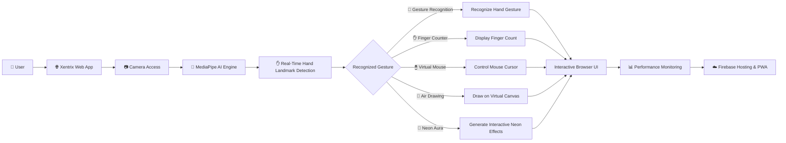
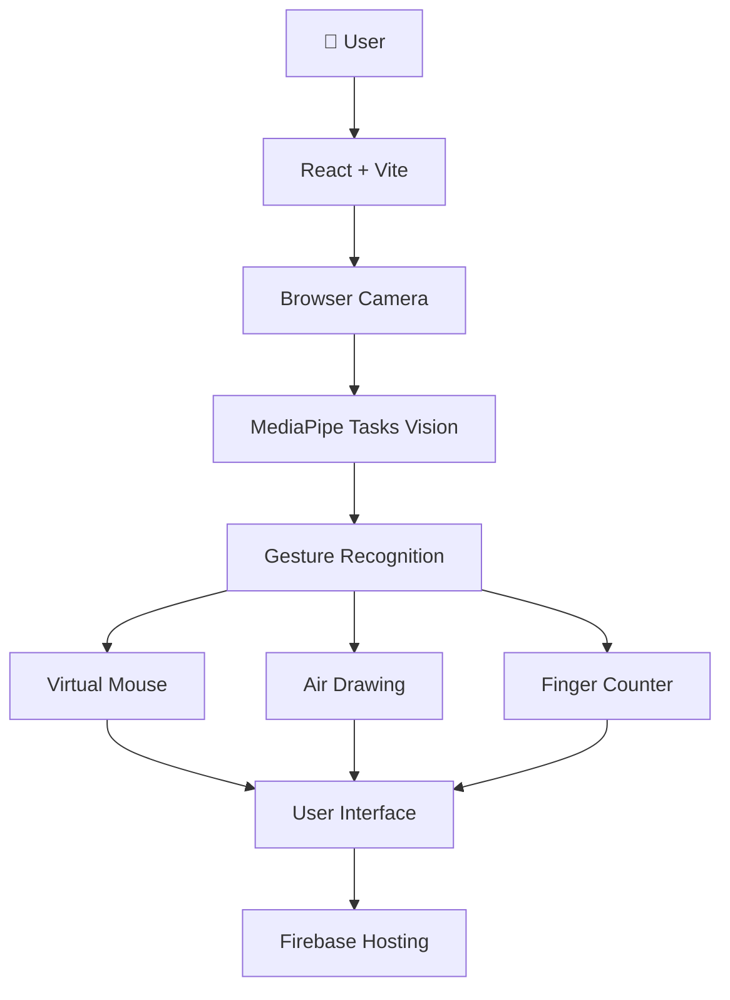

<div align="center">


<br><br>

# 🤖 Xentrix

### AI-Powered Browser-Based Hand Gesture Recognition Platform

### Transform Your Hands Into Intelligent Controls

Experience real-time AI gesture recognition powered by **MediaPipe**, **React**, **TypeScript**, **Firebase**, and modern Web APIs — all running directly inside your browser.

<br>

<a href="#">
    
</a>

<a href="https://github.com/sovanshit/Xentrix">
    
</a>

<a href="#">
    
</a>

<br><br>


</div>

---

# 🌐 Live Demo

Experience the live version of **Xentrix** and explore AI-powered gesture recognition directly in your browser.

<div align="center">

<a href="#">


</a>

</div>

---

# 📖 About

**Xentrix** is a browser-based Artificial Intelligence platform that transforms natural hand gestures into powerful digital interactions.

Built using **React**, **TypeScript**, **MediaPipe**, **Firebase**, and modern Web APIs, Xentrix enables users to interact with multiple AI modules—including **Gesture Recognition**, **Virtual Mouse**, **Air Drawing**, and **Finger Counter**—without requiring any software installation.

Unlike traditional computer vision applications, every AI model runs entirely inside the browser, ensuring:

- ⚡ Faster performance
- 🔒 Better privacy
- 🖥️ Zero backend AI processing
- 🌍 Cross-platform compatibility
- 📱 Progressive Web App support
- 🚀 Near real-time gesture recognition

Xentrix demonstrates how modern web technologies and browser-based machine learning can create intelligent, interactive experiences using only a webcam.

---

## 🎯 Objectives

- Build a browser-based AI gesture recognition platform.
- Demonstrate real-time hand tracking using MediaPipe.
- Replace traditional input methods with natural gestures.
- Deliver high-performance client-side AI processing.
- Create a modern and responsive Progressive Web App.
- Showcase practical AI applications using web technologies.

---

# 🚀 Development Timeline

| Phase | Duration |
|--------------------------------------------|-------------------------|
| Project Planning & Research | February 2025 |
| UI / UX Design & Prototyping | March – June 2025 |
| Frontend Development (React + Vite) | July – September 2025 |
| AI Playground Development | October 2025 |
| Hand Gesture Recognition Integration | November 2025 |
| Virtual Mouse Development | December 2025 |
| Air Drawing Module | January 2026 |
| Finger Counter Module | February 2026 |
| Neon Aura Visualization Module | March 2026 |
| Research & Feature Planning | April 2026 |
| PWA & Firebase Integration | May – June 2026 |
| Testing & Performance Optimization | July 2026 |
| Documentation & Open Source Preparation | August 2026 |
| Public Release | September 2026 |

**Development Period:** **February 2025 – September 2026**

> 🚀 Xentrix evolved from a simple hand gesture recognition project into a comprehensive AI-powered browser platform featuring Gesture Recognition, Virtual Mouse, Air Drawing, Finger Counter, Neon Aura visualization, and an interactive AI Playground—demonstrating the potential of real-time computer vision directly in the browser.

---

# ✨ Key Features

<table>

<tr>

<td width="50%">

### 🤖 AI Recognition

- Real-Time Hand Tracking
- MediaPipe AI Integration
- Gesture Recognition
- Live Hand Landmark Tracking
- Browser-Based AI Processing

</td>

<td width="50%">

### 🖐 Interactive Modules

- AI Playground
- Gesture Recognition
- Virtual Mouse
- Air Drawing
- Finger Counter
- Neon Aura Visualization

</td>

</tr>

<tr>

<td>

### ⚡ Performance

- Zero Backend Processing
- High FPS Rendering
- Low Latency Response
- Optimized AI Pipeline
- Efficient Camera Handling

</td>

<td>

### 🌐 Platform Features

- Progressive Web App (PWA)
- Installable on Desktop & Mobile
- Responsive Glassmorphism UI
- Firebase Hosting
- Modern Dark Theme
- Cross-Browser Support

</td>

</tr>

</table>

---

# ⚙️ Tech Stack

<div align="center">


<br><br>

| Frontend | AI & Vision | Database / Hosting | Tools |
|-----------|-------------|--------------------|-------|
| React 18 | MediaPipe Tasks Vision | Firebase Hosting | VS Code |
| TypeScript | TensorFlow Web APIs | Cloud Firestore | Git |
| Vite | Browser Camera API | Firebase SDK | GitHub |
| Tailwind CSS | Canvas API | PWA | npm |

</div>

---

# 🚀 Project Workflow



---

# 📂 Project Modules

| Module | Description |
|---------|-------------|
| 🏠 Home | Modern landing page introducing Xentrix and browser-based AI hand gesture technology. |
| 🤖 AI Playground | Interactive hub to explore and launch all AI-powered gesture modules. |
| ✋ Gesture Recognition | Recognizes predefined hand gestures with real-time landmark tracking. |
| 🖱 Virtual Mouse | Control your mouse cursor and perform clicks using natural hand movements. |
| 🎨 Air Drawing | Draw on a virtual canvas using finger gestures with colors, brush controls, and gesture-based tools. |
| ✌️ Finger Counter | Detect and count raised fingers instantly with live hand analysis. |
| 🌌 Neon Aura | Experience futuristic neon hand visualization with particles, energy effects, lightning, and multiple visual themes. |
| 📖 Documentation | Explore guides, technologies, features, and implementation details of Xentrix. |
| 📞 Contact | Connect with the developer for feedback, collaboration, or support. |

---

## 📌 Core Functionalities

- ✅ Browser-Based AI Processing
- ✅ Real-Time Hand Tracking
- ✅ AI Gesture Recognition
- ✅ Live Hand Landmark Detection
- ✅ Virtual Mouse Control
- ✅ Air Drawing Canvas
- ✅ Finger Counter
- ✅ Neon Aura Visualization
- ✅ Dynamic Particle & Energy Effects
- ✅ Multiple Interactive Themes
- ✅ Progressive Web App (PWA)
- ✅ Firebase Hosting
- ✅ Responsive Cross-Platform Design
- ✅ Modern Glassmorphism Interface
- ✅ Dark Mode User Experience
- ✅ High-Performance Real-Time Rendering
- ✅ Camera Permission Management
- ✅ Zero Backend AI Processing

---

# 📸 Project Screenshots

A quick overview of the Xentrix interface and its primary AI modules.

---

## 🏠 Home Page

The landing page introduces Xentrix with a futuristic glassmorphism interface, animated backgrounds, and quick access to AI-powered gesture modules.


---

## 🤖 AI Playground

The AI Playground serves as the central workspace where users can launch different gesture-powered tools and experience real-time browser AI.


---

# 🤖 Gesture Recognition

Xentrix uses Google's **MediaPipe Tasks Vision** to detect and classify hand gestures directly inside the browser.


---

## Recognition Features

| Feature | Description |
|---------|-------------|
| ✋ Real-Time Hand Tracking | Detects hands instantly using the webcam |
| 🤖 AI Gesture Recognition | Identifies predefined hand gestures |
| ⚡ Ultra Fast Prediction | Browser-based inference with low latency |
| 🎯 High Accuracy | AI-powered landmark detection |
| 🔒 Privacy First | Processing stays entirely on your device |

---

# 🖱 Virtual Mouse

The Virtual Mouse module allows users to control the computer cursor using only hand gestures.


---

## Virtual Mouse Features

| Feature | Description |
|---------|-------------|
| 🖱 Cursor Movement | Move the mouse with hand motion |
| 👆 Left Click | Perform click gestures |
| ✌ Right Click | Dedicated gesture support |
| 📜 Scroll Support | Navigate pages naturally |
| ⚡ Smooth Tracking | AI-based motion smoothing |

---

# 🎨 Air Drawing

Transform your hand into a virtual paintbrush with **Xentrix Air Drawing**. Draw naturally in the air using real-time hand tracking—no mouse, stylus, or touch input required. One hand controls drawing while the other manages colors, brush size, erase, and canvas actions.


---

## ✨ Air Drawing Features

| Feature | Description |
|---------|-------------|
| ✍️ Finger Drawing | Draw naturally using your index finger |
| 🎨 Smart Color Selection | Switch between multiple ink colors with hand gestures |
| 📏 Dynamic Brush Size | Adjust brush thickness using finger pinch distance |
| 🧽 Gesture Eraser | Erase drawings with an open-hand gesture |
| 🗑️ Clear Canvas | Instantly clear the entire canvas using a fist gesture |
| ↩️ Undo & Redo | Restore or revert recent strokes |
| 💾 Download Artwork | Save your drawing as a PNG image |
| ⚡ Real-Time Rendering | Smooth, low-latency drawing experience |
| 🖥️ Browser-Based | No installation required—runs entirely in your browser |

---

## 🕹️ Gesture Controls

| Gesture | Action |
|---------|--------|
| ☝️ Index Finger | Draw on the canvas |
| ✋ Open Hand | Activate Eraser Mode |
| 👊 Closed Fist | Clear the entire canvas |
| 🤏 Thumb + Index Pinch | Adjust brush thickness |
| 1️⃣–4️⃣ Fingers (Other Hand) | Select drawing color |
| 🖱️ Undo / Redo / Download | Available through toolbar controls |

---

## 📸 Interface Overview

The Air Drawing workspace provides a modern dark-themed interface designed for an intuitive drawing experience.

### Workspace Includes

- 🎨 Active color indicator
- 🖌️ Live brush size display
- ✨ Full-screen drawing canvas
- ↩️ Undo & Redo controls
- 💾 Download artwork button
- 📖 Built-in gesture guide and usage instructions


---

> 🚀 **Xentrix Air Drawing** demonstrates the power of browser-based AI hand tracking, enabling a seamless and interactive drawing experience using only natural hand gestures.

---

# 🌌 Neon Aura

Neon Aura is an advanced visual demonstration of **real-time AI hand tracking**. It transforms detected hand landmarks into vibrant neon skeletons, glowing fingertip trails, dynamic particle effects, and interactive energy waves—creating an immersive futuristic experience powered entirely inside your browser.


---

## ✨ Neon Aura Features

| Feature | Description |
|---------|-------------|
| 🌈 Neon Hand Skeleton | Real-time glowing hand landmark visualization |
| ✨ Fingertip Particle Effects | Dynamic particles emitted from fingertips |
| ⚡ Energy Shockwave | Trigger expanding neon waves using pinch gestures |
| 🌩️ Cross-Hand Lightning | Animated energy links between both hands |
| 🎨 Multiple Visual Themes | Rainbow, Cyberpunk, Lava, Ocean, and Galaxy |
| 📊 Live Gesture Detection | Display current detected gesture instantly |
| 📏 Hand Spread Analysis | Real-time hand openness percentage |
| 🔊 Optional Sound Effects | Toggle immersive audio feedback |
| ⚡ Browser-Based Rendering | Runs entirely in your browser without installation |

---

## 🎮 Gesture Controls

| Gesture | Action |
|---------|--------|
| ✋ Open Hand | Activate Neon Aura visualization |
| 🤏 Pinch Gesture | Trigger energy shockwave |
| 👐 Two Hands | Generate cross-hand lightning effects |
| 🌈 Theme Buttons | Switch between Neon Aura visual themes |
| 🔊 Sound Toggle | Enable or disable sound effects |

---

## 🌈 Available Themes

| Theme | Effect |
|--------|--------|
| 🌈 Rainbow | Multi-colored animated neon trails |
| 💜 Cyberpunk | Purple and cyan futuristic glow |
| 🔥 Lava | Orange and red energy particles |
| 🌊 Ocean | Blue and aqua flowing effects |
| 🌌 Galaxy | Cosmic purple nebula lighting |

---

## 📸 Interface Overview

The Neon Aura module combines AI hand tracking with advanced visual effects for an immersive interactive experience.

### Workspace Includes

- 🌈 Live neon hand skeleton
- ✨ Dynamic fingertip particles
- ⚡ Interactive shockwave animation
- 🌩️ Cross-hand energy connections
- 📊 Real-time gesture information
- 📏 Hand spread percentage
- 🎨 Theme selector
- 🔊 Audio control


---

> 🚀 **Neon Aura** showcases the artistic side of AI-powered hand tracking by combining computer vision, particle systems, neon lighting, and real-time interaction into a futuristic browser experience.

---

# ✌ Finger Counter

The Finger Counter module detects raised fingers using MediaPipe hand landmarks.


---

## Finger Counter Features

| Feature | Description |
|---------|-------------|
| ✋ Finger Detection | Detects all five fingers |
| 🔢 Live Counting | Instant finger count |
| ⚡ Fast Processing | Real-time browser inference |
| 📷 Webcam Support | Works directly from camera |
| 🤖 AI Landmark Detection | Powered by MediaPipe |

---

# ☁️ Firebase Integration

Xentrix uses **Firebase** for modern cloud infrastructure while keeping AI processing entirely inside the browser.

Firebase powers hosting and analytics without affecting user privacy.

---

## Firebase Services

| Service | Purpose |
|----------|---------|
| 🌐 Firebase Hosting | Fast global website deployment |
| 📊 Firebase Analytics | Visitor insights and usage statistics |
| 🔥 Firebase SDK | Application integration |

---

## Benefits of Firebase

- ⚡ Fast Global Hosting
- 🔒 Secure Infrastructure
- 📈 Usage Analytics
- 🚀 Reliable Deployment
- 🌍 CDN Powered Delivery

---

# 📂 Project Structure

```text
📦 Xentrix
│
├── 📂 public
│   ├── icons
│   ├── images
│   └── manifest
│
├── 📂 src
│   ├── components
│   ├── pages
│   ├── hooks
│   ├── services
│   ├── styles
│   ├── utils
│   ├── data
│   ├── types
│   ├── App.tsx
│   └── main.tsx
│
├── 📂 screenshots
│
├── 📜 index.html
├── 📜 package.json
├── 📜 vite.config.ts
├── 📜 tailwind.config.js
├── 📜 firebase.json
├── 📜 .firebaserc
└── 📜 README.md
```

---

# 🏗 Project Architecture



---

## Folder Description

| Folder | Description |
|---------|-------------|
| 📂 components | Reusable UI components |
| 📂 pages | Application pages |
| 📂 hooks | Custom React hooks |
| 📂 services | AI and utility services |
| 📂 styles | Global styling |
| 📂 utils | Helper functions |
| 📂 data | Static data |
| 📂 types | TypeScript definitions |
| 📂 screenshots | README images |

---

> 📌 Xentrix follows a modular architecture that keeps AI processing, UI components, and application logic organized for scalability and future feature expansion.

---

# 🚀 Installation

Follow these steps to run **Xentrix** locally.

---

## 1️⃣ Clone the Repository

```bash
git clone https://github.com/sovanshit/Xentrix.git
```

---

## 2️⃣ Navigate to the Project

```bash
cd Xentrix
```

---

## 3️⃣ Install Dependencies

```bash
npm install
```

---

## 4️⃣ Configure Environment Variables

Create a `.env` file in the project root.

```env
VITE_FIREBASE_API_KEY=YOUR_API_KEY
VITE_FIREBASE_AUTH_DOMAIN=YOUR_AUTH_DOMAIN
VITE_FIREBASE_PROJECT_ID=YOUR_PROJECT_ID
VITE_FIREBASE_STORAGE_BUCKET=YOUR_STORAGE_BUCKET
VITE_FIREBASE_MESSAGING_SENDER_ID=YOUR_SENDER_ID
VITE_FIREBASE_APP_ID=YOUR_APP_ID
```

> **Note:** Environment variables are only required when enabling Firebase features.

---

## 5️⃣ Start Development Server

```bash
npm run dev
```

Open your browser and visit:

```text
http://localhost:5173
```

---

## 6️⃣ Build for Production

```bash
npm run build
```

---

## 7️⃣ Preview Production Build

```bash
npm run preview
```

---

## 8️⃣ Deploy to Firebase Hosting

Install Firebase CLI (first time only):

```bash
npm install -g firebase-tools
```

Login to Firebase:

```bash
firebase login
```

Initialize Hosting (if not already configured):

```bash
firebase init hosting
```

Deploy the website:

```bash
firebase deploy
```

---

# 🔒 Privacy & Security

Xentrix is designed with **privacy-first AI** principles.

Unlike cloud-based AI services, all gesture recognition happens directly inside your browser.

No webcam images are uploaded to external servers.

---

## Security Highlights

| Feature | Description |
|---------|-------------|
| 🔒 Local AI Processing | Recognition runs entirely inside the browser |
| 📷 Camera Privacy | Webcam frames never leave your device |
| ⚡ No Backend Required | Eliminates unnecessary server communication |
| 🌐 Secure HTTPS Deployment | Hosted securely using Firebase Hosting |
| 🚫 No Personal Data Collection | No account required to use AI features |
| 🛡 Browser Permissions | Camera access only after user approval |

---

# 📈 Future Roadmap

The following features are planned for future releases.

| Feature | Status |
|---------|:------:|
| 🤟 Sign Language Recognition | 🚧 Planned |
| 🖱 Advanced Virtual Mouse | 🚧 Planned |
| 🎮 Gesture-Based Gaming Controls | 🚧 Planned |
| 📱 Mobile Optimization | 🚧 Planned |
| 🧠 Custom Gesture Training | 🚧 Planned |
| 🤖 AI Gesture Assistant | 🚧 Planned |
| 🎨 Multi-Layer Air Canvas | 🚧 Planned |
| 🌍 Multi-language Support | 🚧 Planned |
| ☁️ Cloud Sync | 🚧 Planned |
| 📊 Gesture Analytics Dashboard | 🚧 Planned |

---

# 📊 Project Statistics

| Metric | Value |
|---------|------:|
| 💻 Frontend Pages | 8+ |
| 🤖 AI Modules | 4 |
| 📷 Webcam Support | Included |
| 🧠 AI Engine | MediaPipe Tasks Vision |
| ⚛ Frontend | React + TypeScript |
| ⚡ Build Tool | Vite |
| ☁️ Hosting | Firebase Hosting |
| 📱 Responsive Design | Yes |
| 🌙 Dark Theme | Yes |
| 📦 PWA Support | Yes |

---

# ⚡ Performance Highlights

| Feature | Status |
|---------|:------:|
| Browser-Based AI | ✅ |
| GPU Acceleration | ✅ |
| Real-Time Processing | ✅ |
| Responsive UI | ✅ |
| Progressive Web App | ✅ |
| Cross-Platform Support | ✅ |
| Offline Ready (PWA) | ✅ |

---

# 🌍 Browser Compatibility

<div align="center">

| Chrome | Edge | Brave | Opera | Firefox |
|:------:|:----:|:-----:|:------:|:--------:|
| ✅ | ✅ | ✅ | ✅ | ⚠️ Partial |

</div>

---

# 💡 Why Xentrix?

Xentrix demonstrates the power of **browser-native artificial intelligence**, combining modern web technologies with real-time computer vision.

The project proves that advanced AI experiences can run entirely on the client side—without dedicated servers or expensive cloud infrastructure.

Whether it's controlling a computer using gestures, drawing in the air, or recognizing hand movements, Xentrix showcases the future of human-computer interaction.

---

# 🤝 Contributing

Contributions are always welcome.

Whether it's improving the UI, optimizing AI performance, fixing bugs, or suggesting new gesture modules, every contribution helps make Xentrix better.

---

## Contribution Workflow

```text
Fork Repository
        │
        ▼
Create Feature Branch
        │
        ▼
Commit Changes
        │
        ▼
Push Branch
        │
        ▼
Open Pull Request
```

---

# 👨‍💻 Developer

<div align="center">

## Sovan Shit

### Frontend Developer • AI Web Developer

Building modern browser-based AI experiences using cutting-edge web technologies.

</div>

---

### Responsibilities

- 🎨 UI / UX Design
- ⚛ React Development
- 🤖 AI Feature Integration
- ✋ Gesture Recognition System
- 🖱 Virtual Mouse Development
- 🎨 Air Drawing Module
- ✌ Finger Counter
- ☁ Firebase Hosting & Deployment
- 📱 Responsive Design
- ⚡ Performance Optimization
- 📦 Progressive Web App (PWA)

---

# 🏆 Project Highlights

- 🤖 Browser-Based Artificial Intelligence
- ✋ Real-Time Hand Gesture Recognition
- 🖱 AI Virtual Mouse
- 🎨 Air Drawing Canvas
- ✌ Finger Counter
- ⚡ MediaPipe Tasks Vision Integration
- ⚛ React + TypeScript
- 🚀 Vite Powered
- 🎨 Tailwind CSS UI
- 🌙 Modern Glassmorphism Design
- 📱 Fully Responsive
- 📦 Progressive Web App (PWA)
- ☁ Firebase Hosting
- 🔒 Privacy-First Processing
- 🌍 Cross-Platform Support

---

# 🙏 Acknowledgements

Special thanks to the amazing open-source technologies and communities that made Xentrix possible.

- Google MediaPipe
- TensorFlow
- React
- TypeScript
- Vite
- Tailwind CSS
- Firebase
- Lucide Icons
- Motion
- GitHub
- VS Code
- Open Source Community ❤️

---

# 📄 License

This project is developed for **educational, research, and portfolio purposes**.

You are welcome to explore the source code, learn from it, and build upon it for non-commercial use while giving appropriate credit.

---

# 🌍 Live Website

The official public release of **Xentrix** is coming soon.

Stay tuned for the launch and experience AI-powered gesture recognition directly in your browser.

<div align="center">

<a href="#">


</a>

</div>

---

# ⭐ Repository Statistics

<div align="center">


</div>

---

# 💙 Support the Project

If you found **Xentrix** useful or interesting, please consider supporting the project.

⭐ Star the repository

🍴 Fork it

🐞 Report bugs

💡 Suggest new AI features

🤝 Share it with others

Every contribution and every star motivates future development.

---

<div align="center">

# ⭐ Thank You for Visiting Xentrix

### Building the Future of Browser-Based Artificial Intelligence

Made with ❤️ by **Sovan Shit**

</div>
